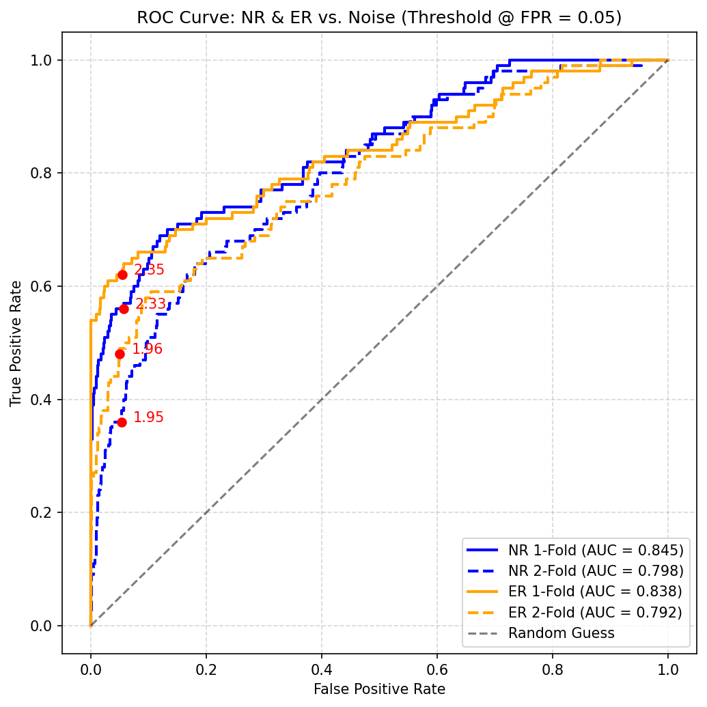

---

## Quick Notes

### Date

`2025-06-02`

### Key Points

* Definition of efficiency
* Manual inspection and stat for dark count
* 2-fold efficiency vs 1-fold

---

### Definition of efficiency
* Setup
    Individual channel fixed OF  
    ch1-44 use uv template extracted from TraceSimulator  
    ch45 uses ch45 qp template  
    [ch46:] use ch46+ qp template  
* 
---

### Manual inspection and Stat for dark count
* Setup
    [Same as Definition of efficiency section](#Definition of efficiency)
 
* Manual inspection
    1. There are some noise shows similar general shape as the template with ampl around 1, which is ineviably but have their chisq(~0.87) usually smaller than the signal fitting(0.88-1.0)
    2. For submerged channel, 2fold cannot effectively improve the AUC compare to 1fold(please see the ROC below). Multi-fold might be a good plan for vacuum channels and NR events.  
* Stat
    Stat has been made with 1000 set of MMC noise traces with noise power of 33.2.  
    So to get more information/validation I made the ROC

```python
# Example snippet
print("Hello, world")
```
---
### Study on the 2-fold
    The plot includes the ROC curves of singlet and 2-fold trigger together would be helpful. There are a few information we can extract from the ROC curve
    1. The 2-fold may not effective increase the AUC of trigger's ROC curve, 
    

---

### Question
* For the noise traces with amplitude, they usually have chisq ~0.87 and is smaller than the chisq for fitting signal traces, could this be used for classifier?  
* 